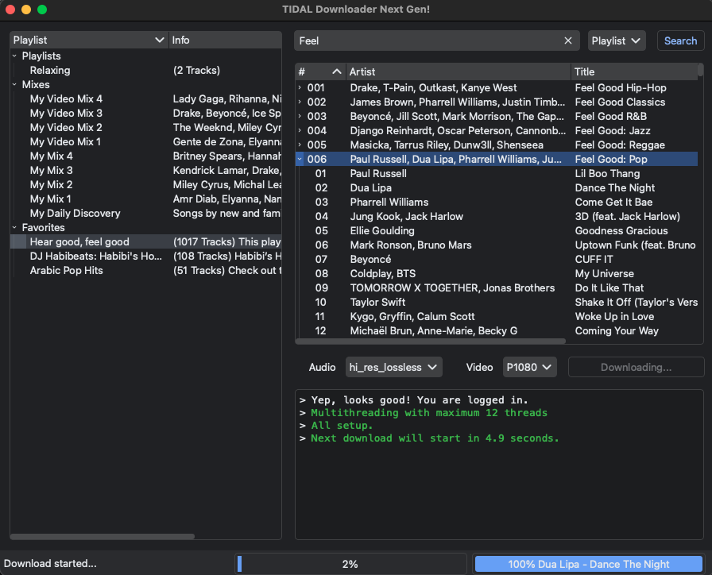

# 🔰 TIDAL Downloader Next Generation! (tidal-dl-ng)

[](https://img.shields.io/github/v/release/exislow/tidal-dl-ng)
[](https://github.com/exislow/tidal-dl-ng/actions/workflows/on-release-master.yml)
[](https://img.shields.io/github/commit-activity/m/exislow/tidal-dl-ng)
[](https://img.shields.io/github/license/exislow/tidal-dl-ng)

This tool allows to download songs and videos from TIDAL. Multithreaded and multi-chunked downloads are supported.

⚠️ **Windows** Defender / **Anti Virus** software / web browser alerts, while you try to download the app binary: This is a **false positive**. Please read [this issue](https://github.com/exislow/tidal-dl-ng/issues/231), [PyInstaller (used by this project) statement](https://github.com/pyinstaller/pyinstaller/blob/develop/.github/ISSUE_TEMPLATE/antivirus.md) and [the alternative installation solution](https://github.com/exislow/tidal-dl-ng/?tab=readme-ov-file#-installation--upgrade).

**A paid TIDAL plan is required!** Audio quality varies up to HiRes Lossless / TIDAL MAX 24-bit, 192 kHz depending on the song available. You can use the command line or GUI version of this tool.



```bash
$ tidal-dl-ng --help

 Usage: tidal-dl-ng [OPTIONS] COMMAND [ARGS]...

╭─ Options ────────────────────────────────────────────────────────────────────╮
│ --version  -v                                                                │
│ --help     -h        Show this message and exit.                             │
╰──────────────────────────────────────────────────────────────────────────────╯
╭─ Commands ───────────────────────────────────────────────────────────────────╮
│ cfg    Print or set an option. If no arguments are given, all options will   │
│        be listed. If only one argument is given, the value will be printed   │
│        for this option. To set a value for an option simply pass the value   │
│        as the second argument                                                │
│ dl                                                                           │
│ dl_fav Download from a favorites collection.                                 │
│ gui                                                                          │
│ login                                                                        │
│ logout                                                                       │
╰──────────────────────────────────────────────────────────────────────────────╯
```

If you like this projects and want to support it, feel free to buy me a coffee 🙃✌️

<a href="https://www.buymeacoffee.com/exislow" target="_blank"></a>
<a href="https://ko-fi.com/exislow" target="_blank" rel="noopener noreferrer"></a>

## 💻 Installation / Upgrade

**Requirements**: Python version 3.12 or 3.13 (other versions might work but are not tested!)

```bash
pip install --upgrade tidal-dl-ng
# If you like to have the GUI as well use this command instead
pip install --upgrade "tidal-dl-ng[gui]"
```

## ⌨️ Usage

You can use the command line (CLI) version to download media by URL:

```bash
tidal-dl-ng dl https://tidal.com/browse/track/46755209
# OR
tdn dl https://tidal.com/browse/track/46755209
```

Or by your favorites collections:

```bash
tidal-dl-ng dl_fav tracks
tidal-dl-ng dl_fav artists
tidal-dl-ng dl_fav albums
tidal-dl-ng dl_fav videos
```

You can also use the GUI:

```bash
tidal-dl-ng-gui
# OR
tdng
# OR
tidal-dl-ng gui
```

If you like to have the GUI version only as a binary, have a look at the
[release page](https://github.com/exislow/tidal-dl-ng/releases) and download the correct version for your platform.

## 🧁 Features

- Download tracks, videos, albums, playlists, your favorites etc.
- Multithreaded and multi-chunked downloads
- Metadata for songs
- Adjustable audio and video download quality.
- FLAC extraction from MP4 containers
- Lyrics and album art / cover download
- Creates playlist files
- Can symlink tracks instead of having several copies, if added to different playlist

## ▶️ Getting started with development

### 🚰 Install dependencies

Clone this repository and install the dependencies:

```bash
# First, install Poetry. On some operating systems you need to use `pip` instead of `pipx`
pipx install --upgrade poetry
poetry install --all-extras --with dev,docs
```

The main entry points are:

```bash
tidal_ng_dl/cli.py
tidal_ng_dl/gui.py
```

### 📺 GUI Builder

The GUI is build with `PySide6` using the [Qt Designer](https://doc.qt.io/qt-6/qtdesigner-manual.html):

```bash
PYSIDE_DESIGNER_PLUGINS=tidal_dl_ng/ui pyside6-designer
```

After all changes are saved you need to translate the Qt Designer `*.ui` file into Python code, for instance:

```
pyside6-uic tidal_dl_ng/ui/main.ui -o tidal_dl_ng/ui/main.py
```

This needs to be done for each created / modified `*.ui` file accordingly.

### 🏗 Build the project

To build the project use this command:

```bash
# Install virtual environment and dependencies if not already done
make install
# Build macOS GUI
make gui-macos
# Check build output
ls dist/
```

See the `Makefile` for all available build commands.

The CI/CD pipeline will be triggered when you open a pull request, merge to main, or when you create a new release.

To finalize the set-up for publishing to PyPi or Artifactory, see [here](https://fpgmaas.github.io/cookiecutter-poetry/features/publishing/#set-up-for-pypi).
For activating the automatic documentation with MkDocs, see [here](https://fpgmaas.github.io/cookiecutter-poetry/features/mkdocs/#enabling-the-documentation-on-github).
To enable the code coverage reports, see [here](https://fpgmaas.github.io/cookiecutter-poetry/features/codecov/).

## ❓ FAQ

### macOS Error Message: File/App is damaged and cannot be opened. You should move it to Trash

If you download an (unsigned) app from any source other than those that Apple seems suited, the application gets an extended attribute "com.apple.Quarantine". This triggers the message: "<application> is damaged and can't be opened. You should move it to the Bin."

Remove the attribute and you can launch the application. [Source 1](https://discussions.apple.com/thread/253714860?sortBy=rank) [Source 2](https://www.reddit.com/r/macsysadmin/comments/13vu7f3/app_is_damaged_and_cant_be_opened_error_on_ventura/)

```
sudo xattr -dr com.apple.quarantine /Applications/TIDAL-Downloader-NG.app/
```

Why is this app unsigned? Only developer enrolled in the paid Apple developer program are allowed to sign (legal) apps. Without this subscription app signing is not possible.

Gatekeeper really annoys you, and you like to disable it completely? Follow this [link](https://iboysoft.com/tips/how-to-disable-gatekeeper-macos-sequoia.html)

### My (Windows) antivirus app XYZ says the GUI version of this app is harmful

Short answer: It is a lie. Get rid of your antivirus app.

Long answer: See [here](https://github.com/exislow/tidal-dl-ng/issues/231)

### I get an error when `extract_flac` is enabled

Your `path_binary_ffmpeg` is probably wrong. Please read over and over again the help of this particular option until you get it right what path to put for `path_binary_ffmpeg`.

## ‼️ Disclaimer

- For educational purposes only. I am not liable and responsible for any damage that happens.
- You should not use this method to distribute or pirate music.
- It may be illegal to use this app in your country.

## 🫂 Contributors

Thanks to all, who have contributed to this project!

Special thanks goes out to [@orbittwz](https://github.com/orbittwz) for all his support in the issues section.

<a href="https://github.com/exislow/tidal-dl-ng/graphs/contributors"></a>

This project is based on:

- [cookiecutter-poetry](https://fpgmaas.github.io/cookiecutter-poetry/)
